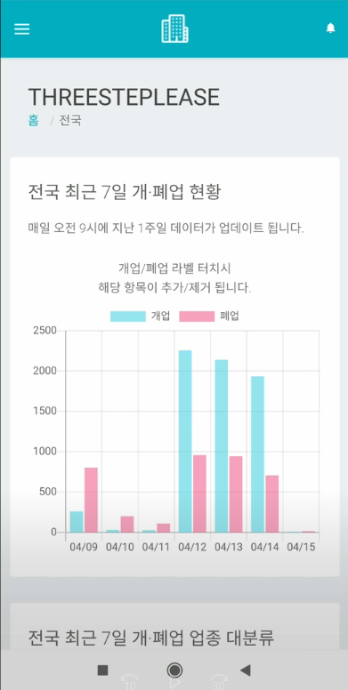

# 상가 개·폐업 정보 안드로이드 앱

## 화면



## 시연 동영상

<https://www.youtube.com/watch?v=cI0wmqA1fdw>

### 사용방법

웹사이트와 사용방법이 동일합니다. <br/>
사용법 보러가기 :
<https://github.com/dkstjdwns114/three_step_lease>

<br/>

## Front-end

- React.js

## Back-end

- Django
- MongoDB
- 백엔드 코드는 사용방법 보러가기에 링크걸려있는 github에 업로드 되어있습니다.

## Android

- Framework : Cordova
- 푸시알림 : FCM (Firebase Cloud Messaging)

## apk 다운로드

- 루트폴더에 downloadApk/THREESTEP.apk
- <https://github.com/dkstjdwns114/three_step_lease_cordova/tree/master/downloadApk>

<br/>

### 앱 제작 계기

매일 업데이트되는 실시간 데이터 업데이트시 푸시알림을 보내 언제 어디서나 인터넷이 되는곳이라면 바로바로 손쉽게 확인할 수 있게 하기 위해 이 앱을 제작하게 되었습니다.

<br/><br/>

### 문서 구조

<br/>

```sh
├─public
│    index.html
│    template js and css
│
└─src
  │ App.js
  │ index.js
  ├───components
  │     ├─Chart
  │     │     CityMonthLineChart.js  <-- 최근 2년 월별 차트
  │     │     HorizontalBarChart.js  <-- 최근 2년 업종 대분류 바차트
  │     │     PieChart.js            <-- 최근 2년 업종 중분류 차트
  │     │     RadarCahrt.js          <-- 최근 2년 업종 중분류 레이더차트
  │     │     RealTimeBarChart.js    <-- 실시간데이터 갯수 차트
  │     │     RealTimePolarChart.js  <-- 실시간데이터 업종 대분류 차트
  │     │
  │     ├─Loading
  │     │     PageLoading.js         <-- 전체 페이지 로딩
  │     │     RoudCircleLoading.js   <-- 로딩 느린 View 로딩
  │     │
  │     ├─Map
  │     │     CityMap.js             <-- 최근 2년 행정구역별 현황 지도
  │     │     RealTimeCityMap.js     <-- 실시간데이터 지도
  │     │     SameAddressMap.js      <-- 최근 2년 같은주소 지도
  │     │
  │     ├─Modal
  │     │     Modal.js               <-- 공지사항
  │     │
  │     ├─Navigation
  │     │     DropDownMenu.js        <-- Drop down 메뉴
  │     │     MainNavbar.js          <-- 상단바
  │     │     PageFooter.js          <-- 푸터
  │     │     PageHeader.js          <-- 페이지 헤더
  │     │
  │     ├─ScrollToTop
  │     │     ScrollToTop.js         <-- 페이지 전환시 스크롤 Top
  │     │
  │     ├─Tab
  │     │     CategoryTabs.js        <-- 최근 2년 업종 대분류 차트 전환 탭
  │     │     TabsAccording.js       <-- 최근 2년 같은주소 Top10 탭
  │     │     TypeDetailTabs.js      <-- 최근 2년 업종 중분류 업종 전환 탭
  │     │
  │     ├─Table
  │     │     CustomNoRowsOverlay.js <-- 데이터 없을시 보여주는 View
  │     │     FixedHeaderTable.js    <-- 최근 2년 같은주소 Top10 테이블
  │     │     MonthTable.js          <-- 최근 2년 월별 테이블
  │     │     RealTimeCategoryEmpty.js  <-- 실시간데이터 업종 대분류 데이터 없을시
  │     │     RealTimeTable.js       <-- 실시간데이터 테이블
  │     │
  │     └─View
  │           CategoryView.js         <-- 최근 2년 업종 대분류 View
  │           CityMonthView.js        <-- 최근 2년 월별 View
  │           MainCityMapView.js      <-- 최근 2년 행정구역별 현황 View
  │           RealTimeCategoryView.js <-- 실시간데이터 업종 대분류 View
  │           RealTimeCityMapView.js  <-- 실시간데이터 지도 View
  │           RealTimeTableView.js    <-- 실시간데이터 테이블 View
  │           RealTimeTotalView.js    <-- 실시간데이터 전체 현황 View
  │           RealTimeView.js         <-- 실시간데이터 View
  │           SameAddressView.js      <-- 최근 2년 같은주소 View
  │           TypeDetailView.js       <-- 최근 2년 업종 중분류 View
  │
  └─pages
      CityPage.js  <-- 행정구역 상세페이지
      HomePage.js  <-- 메인페이지 (전국 현황)
```
